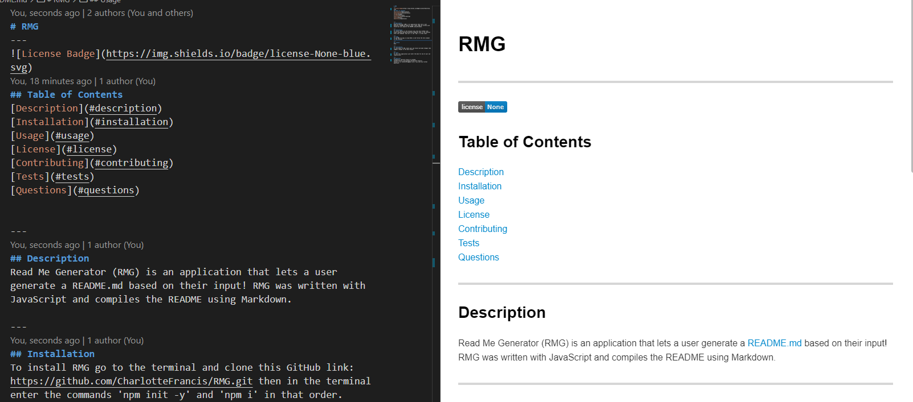

# RMG
---

## Table of Contents
[Description](#description)
[Installation](#installation)
[Usage](#usage)
[License](#license)
[Contributing](#contributing)
[Tests](#tests)
[Questions](#questions)

---
## Description
Read Me Generator (RMG) is an application that allows a user to generate a README.md by using their own input. RMG was made with JavaScript.

Here is an image of the application in use:

---
## Installation
To install RMG go to the repository at https://github.com/CharlotteFrancis/RMG then clone it to your local files. Once you open run 'npm init -y' then 'npm i' and you're all set!

---
## Usage
To use RMG run the command 'node app.js' in the terminal, make sure you have node installed! Once you do that just follow the text prompts in the terminal and it will generate you a README once you choose not to add another section.

---
## License
None

---
## Contributing
If you want to contribute to RMG just create your own branch and then reach out to me if you come up with anything cool.

---
## Tests
If you want to test this application then just fill it out with information on one of your own repositories!

---
## Questions
Created by: CharlotteFrancis on GitHub.
[GitHub Profile Link](github.com/CharlotteFrancis)
Contact me at ChiharuTaru@gmail.com if you have any further questions.
